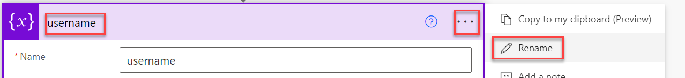
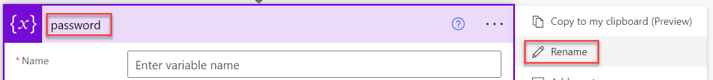
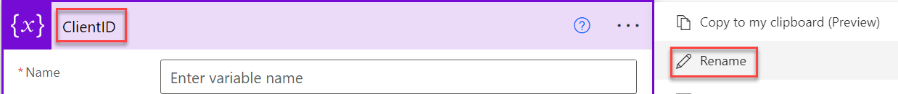
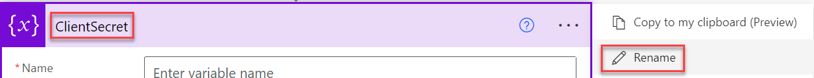

# Create a simple eSignature solution on Power Apps

By Martin Boejstrup, Microsoft 1/28/2022

### Background

Sometimes you need a signature solution in Power Apps. Out of the box there is
two methods: Use the pun input control or use the 3. Part Digital signature
solution.

This solution uses a sign in request as an electronic signature, as a no/low
code using build-in features.  

It uses a cloud flow to call Microsoft Graph sign in request with the username
and password.

There are 3 elements:

-   Azure Ad App Registration: is used to be able to connect to Microsoft Graph.

-   Power Automate Cloud flow: is used to get the request from the app and send
    the sign in request to Microsoft Graph, and respond the result to the app.

-   Power Apps Canvas app: is used to enter the username and password and send
    the request to the cloud flow.

# Create Application Registration in Azure AD

To make the Graph call we need an application key and a secret that have access
to sign in as the user. You need a Tenant Administrator to do that.

1.  Open Azure AD: <https://aad.portal.azure.com/>

2.  Click “App Registration” and “New application registration”  
    

3.  Add a name and click “Create”  
    

4.  Note down the Application Id and tenant id– we need that in the flow  
    

5.  Click “Certificates & secrets” and “+ New client secret”  
    

6.  Add a description (can be any name), set the expirations, and click “Add”  
    

7.  After it is saved the value of the key will shop up – note is down, we need
    it in the cloud flow  
    

8.  Click “API permisions” and “+Add a permission”  
    

9.  Click “Microsoft Graph”  
    

10. Click “Grand admin consent”  
    

11. Click “Yes”  
    

12. Ensure the persissions  
    

# Create cloud flow that make the Graph call

1.  Open Power Automate – <https://flow.microsoft.com>

2.  Click “+New flow” and click “Instant cloud flow”  
    

3.  Add a flow name and choose the “PowerApps” trigger  
    

4.  Add a new step – variable – Initialize variable  
    

5.  Rename the action to “username”  
    

6.  Change the variable name to “username”, set the type to “String” and in
    value click “Dynamic content” and click “Ask in PowerApps”  
    

7.  Add a new variable and rename the action to “password”  
    

8.  Change the variable name to “password”, set the type to “String” and in
    value click “Dynamic content” and click “Ask in PowerApps”  
    

9.  Add a new variable and rename the action to “TenantID”  
    

10. Change the variable name to “password”, set the type to “String” and in
    value add the tenant id you noted down in the previous section.

11. Add a new variable and rename the action to “ClientID” (application id)  
    

12. Change the variable name to “ClientID”, set the type to “String” and in
    value add the client id you noted down in the previous section.  
    

13. Add a new variable and rename the action to “ClientSecret”  
    

14. Change the variable name to “ClientSecret”, set the type to “String” and in
    value add the client secret you noted down in the previous section.  
    

15. Add a “HTTP” action  
    

16. Change the Method to “POST”

17. Change the URL to
    [https://login.microsoftonline.com/@{variables('TenantID')}/oauth2/token](https://login.microsoftonline.com/@%7bvariables('TenantID')%7d/oauth2/token)

18. In Headers add;  
    key: “Content-Type”, Key:“ application/x-www-form-urlencoded”

19. In Body add:  
    [grant_type=password&client_id=@{variables('ClientID')}&username=@{variables('username')}&password=@{variables('password')}&client_secret=@{variables('ClientSecret')}&resource=https://graph.microsoft.com](mailto:grant_type=password&client_id=@%7bvariables('ClientID')%7d&username=@%7bvariables('username')%7d&password=@%7bvariables('password')%7d&client_secret=@%7bvariables('ClientSecret')%7d&resource=https://graph.microsoft.com)

20. 

21. Add a new action “Respond to PowerApp or flow”  
    

22. Add a text output “Response” and “ok”  
    

23. Add a parallel branch  
    

24. Add a the action “Respond to PowerApp or flow”  
    

25. Add a text output “Response” and “error”  
    

26. Open the “Configure run after” on the last action  
    

27. Add checkmark on “has failed” and “has timed out” and click “Done”  
    

28. The flow is now ready – the complete flow:  
    

29. You can now test the flow  
    

# Create the power app

1.  Open Power Apps – <https://powerapps.microsoft.com/>

    1.  Create a new canvas app

    2.  Add 2 text input controls:  
        

    3.  Change the name, and these properties:  
        Name: txtUsername  
        Default: ""  
        HintText: "Enter username"

    4.  Change the name, and these properties  
        Name: txtPassword  
        Default: ""  
        HintText: "Enter password"  
        Mode: TextMode.Password

    5.  Add a Button and update these properties:  
        Name: brtCheck  
        Text: "Check user"

    6.  In the “OnSelect” click “Power Automate”  
        

    7.  In the Flow panel select the “eSignature sign in” flow  
        

    8.  Update the “OnSelect” to:  
        Set(varUsercheck,
        eSignaturesignin.Run(txtUsername,txtPassword).response)  
        

    9.  Add a “Text label” control and set the “text” to: varUsercheck  
        

Now you have a working sample.
